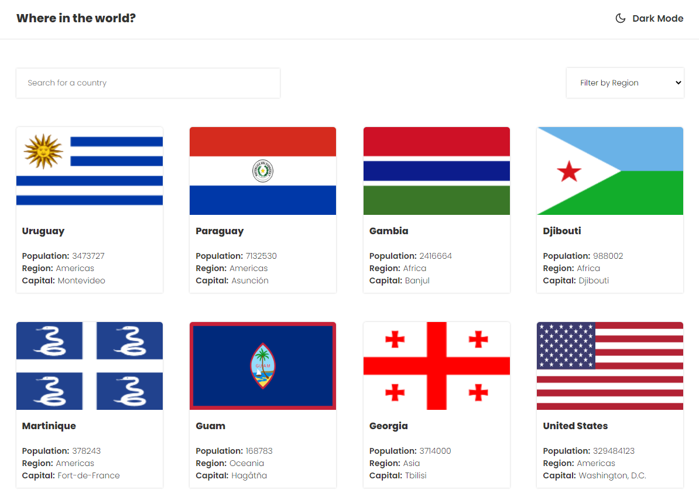

# Frontend Mentor - REST Countries API with color theme switcher solution

This is a solution to the [REST Countries API with color theme switcher challenge on Frontend Mentor](https://www.frontendmentor.io/challenges/rest-countries-api-with-color-theme-switcher-5cacc469fec04111f7b848ca). Frontend Mentor challenges help you improve your coding skills by building realistic projects.

## Table of contents

- [Overview](#overview)
  - [The challenge](#the-challenge)
  - [Screenshot](#screenshot)
  - [Links](#links)
- [My process](#my-process)
  - [Built with](#built-with)
  - [Folder Structure](#folder-structure)
- [Author](#author)


## Overview

### The challenge

Users should be able to:

- See all countries from the API on the homepage
- Search for a country using an `input` field
- Filter countries by region
- Click on a country to see more detailed information on a separate page
- Click through to the border countries on the detail page
- Toggle the color scheme between light and dark mode *(optional)*

### Screenshot




### Links

- Solution URL: [Frontendmentor](https://www.frontendmentor.io/challenges/rest-countries-api-with-color-theme-switcher-5cacc469fec04111f7b848ca)
- Live Site URL: [Link Vercel](https://your-live-site-url.com)

### Built with

- Semantic HTML5 markup
- Styled Components
- Flexbox
- CSS Grid
- React Hooks
- Typescript
- [React](https://reactjs.org/) - JS library
- [Next.js](https://nextjs.org/) - React framework
- [Styled Components](https://styled-components.com/) - For styles
- [Axios](https://axios-http.com/ptbr/docs/intro) - For request
- [React Icons](https://react-icons.github.io/react-icons/) - For icons
- [Storybook](https://storybook.js.org/) - For UI

## My process

In this challenge, react with typescript was used, listing all countries coming from a rest api.

Custom hooks were also created to store the dark and light theme along with localstorage

Downloading the project:
```
https://github.com/geraldobl58/frontendmentor-challenge-countries
```

First you can clone or use this template in your GitHub profile.

```sh
# install the deps
yarn

# run the project
yarn start
```

There is a snippet for quickly creating components.
```
yarn generate Component
```

## Folder Structure

```sh
├── README.md
├── generators # folder to our templates
├── public # folder with our assets
├── src
│   ├── App.tsx # main file to our SPA (We define routes/components here)
│   ├── components
│   │   └──Example
│   │       ├── index.tsx
│   │       ├── styles.ts
│   ├── index.tsx # main file to ReactDom.render
│   ├── pages # we separated our pages/views/screens here
│   │   └── Home.tsx
│   └── styles # any styles that you want to share inside the app
│       └── global.ts
```

## Author

- Website - [Geraldo Luiz](https://www.your-site.com)
- Frontend Mentor - [@geraldobl58](https://www.frontendmentor.io/profile/geraldobl58)
